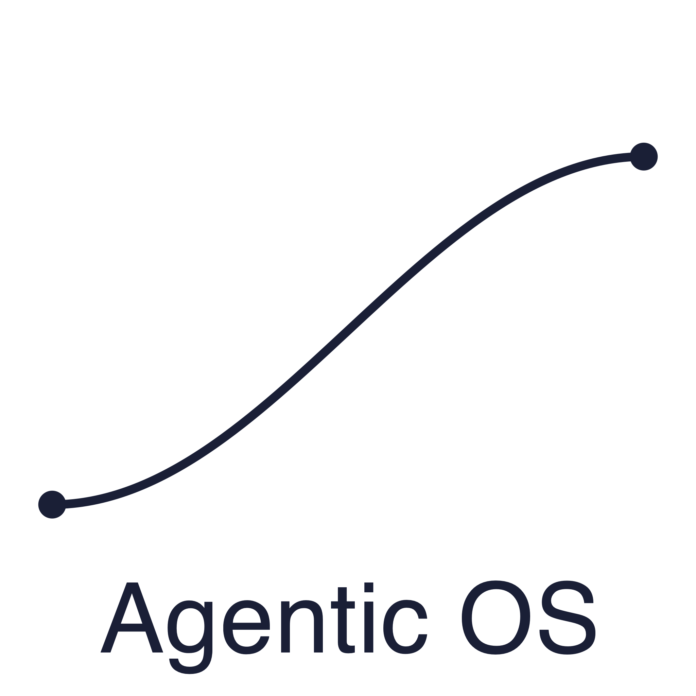
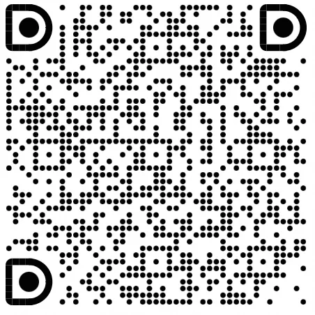

<div align="center">



# ANOLISA

**The operating system layer for Agent workloads.**

[中文版](README_zh.md) · [Website](https://agentic-os.sh/) ·
[Quick Start](docs/QUICKSTART.md) ·
[User Guide](docs/user-guide/en/README.md) ·
[Contributing](CONTRIBUTING.md)

[](LICENSE)
[](docs/user-guide/en/installation.md)

</div>

ANOLISA is a server-side operating layer for AI Agent workloads. It addresses
three practical constraints of Agent execution: terminal entry, Token cost, and
execution environments. Keep the Shell, Agent framework, and sandbox you
already use. ANOLISA CLI provides a single installation entry point, while each
capability can be enabled independently.

## What it solves

<p align="center"><strong>01 · AGENT INTERFACE</strong></p>

<h3 align="center">Let the Agent work directly in the terminal</h3>

cosh-ng gives Agents a structured, predictable interface for Shell and system
operations. Keep the Agent framework and sandbox already in use, and bring
system work into the existing terminal workflow.

[Get started with cosh-ng →](docs/user-guide/en/user-entrypoint/cosh-ng/QUICKSTART.md)

<p align="center"><strong>02 · CONTEXT EFFICIENCY</strong></p>

<h3 align="center">See where Tokens go and cut waste before it reaches the model</h3>

Token-less removes redundancy from tool schemas, responses, and command output.
Agent Memory reuses context across sessions, while AgentSight records where
Tokens are spent.

| Tool responses | Tool schemas | Command output | Full pipeline |
|----------------|--------------|----------------|---------------|
| **65.8% fewer Tokens** | **47.3% fewer Tokens** | **58.6–98.6% less output** | **62.9% fewer Tokens** |
| ResponseCompressor · 46.85 µs | SchemaCompressor · 11.44 µs | RTK · 3 commands tested | 198.91 µs |

[Get started with Token-less →](docs/user-guide/en/token-saving/tokenless/QUICKSTART.md)

<p align="center"><strong>03 · EXECUTION RUNTIME</strong></p>

<h3 align="center">Give every Agent execution a boundary and a way back</h3>

ANOLISA is building out the Agent execution environment:
[Blaze](src/blaze/README.md) manages sandbox orchestration,
[Agent Sec Core](src/agent-sec-core/README.md)
isolates risky operations, [ws-ckpt](src/ws-ckpt/README.md)
keeps recovery points for workspace changes, and
[SkillFS](src/skillfs/README.md) mounts Skills on demand.

[Start with ANOLISA CLI →](docs/user-guide/en/user-entrypoint/anolisa-cli.md)

## Install

ANOLISA CLI is the common installation entry point. Enable cosh-ng, Token-less,
or other capabilities as needed.

```bash
curl -fsSL https://agentic-os.sh/install.sh | bash

anolisa install cosh-ng
anolisa install tokenless
```

[Read the Quick Start →](docs/QUICKSTART.md)

## Documentation

[Quick Start](docs/QUICKSTART.md) ·
[Installation](docs/user-guide/en/installation.md) ·
[User Guide](docs/user-guide/en/README.md) ·
[Troubleshooting](docs/user-guide/en/troubleshooting.md) ·
[Build from Source](docs/BUILDING.md) ·
[Changelog](CHANGELOG.md)

## Community

<div align="center">



Scan with DingTalk to join the ANOLISA community.

</div>

- [Open an issue](https://github.com/alibaba/anolisa/issues) for bugs and
  feature requests.
- Read [CONTRIBUTING.md](CONTRIBUTING.md) before submitting a pull request.
- Report vulnerabilities through the [Security Policy](SECURITY.md).

## License

ANOLISA is released under the [Apache License 2.0](LICENSE).
