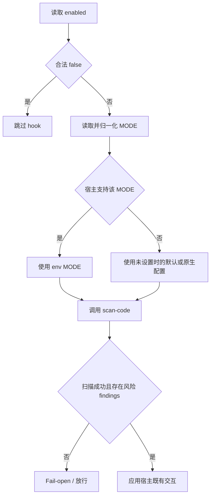

# Code Scanner Hook 能力与配置矩阵

## 1. 文档目标

本文定义 agent-sec-core 在 Qoder、Qwen Code、Codex、Cosh、Hermes 和 OpenClaw 六类 Agent 插件中的 Code Scanner hook 能力边界与配置契约。环境变量只选择宿主当前已经存在的 hook 交互，不得为宿主新增此前不存在的审批或阻断返回类型。

本文只描述 hook 如何消费 `agent-sec-cli scan-code` 的结果。`CODE_SCANNER_MODE` 控制宿主 hook 行为，不等同于 CLI 的 `scan-code --mode regex|llm` 扫描引擎选项。

## 2. Hook 接入矩阵

| Agent 插件 | 实现文件 | Hook 点 | 扫描目标 | 放行返回 | 风险交互 |
|---|---|---|---|---|---|
| Qoder | `qoder-plugin/hooks/code_scanner_hook.py` | `PreToolUse` | `Bash` 的 `tool_input.command` | 无输出 | `permissionDecision=ask/deny` |
| Qwen Code | `qwen-code-extension/hooks/code_scanner_hook.py` | `PreToolUse` | `run_shell_command` 的 `tool_input.command` | `{}` | `permissionDecision=ask/deny` |
| Codex | `codex-plugin/hooks-plugin/hooks/code_scanner_hook.py` | `PreToolUse` | 标准化 Shell 调用的 `tool_input.command` | 无输出 | `decision=block` |
| Cosh | `cosh-extension/hooks/code_scanner_hook.py` | `PreToolUse` | `run_shell_command` / `shell` 的 `tool_input.command` | `decision=allow` | 固定 `decision=ask` |
| Hermes | `hermes-plugin/src/capabilities/code_scan.py` | `pre_tool_call` | `terminal.command` / `execute_code.code` | `None` | `action=block` |
| OpenClaw | `openclaw-plugin/src/capabilities/code-scan.ts` | `before_tool_call` | `exec` 的 `params.command` | `undefined` | `requireApproval` |

所有实现都在工具执行前扫描。Cosh 的 allow 仅用于 `pass`、错误或不适用输入；风险 findings 的既有交互固定为 ask，因此 `CODE_SCANNER_MODE` 不会为 Cosh 增加 observe 或 block 风险处置。

## 3. MODE 能力矩阵

| Agent 插件 | `observe` | `ask` | `block` | 未设置时的行为 |
|---|---|---|---|---|
| Qoder | 支持 | 支持 | 支持，输出既有 `permissionDecision=deny` | `observe` |
| Qwen Code | 支持 | 支持 | 支持，输出既有 `permissionDecision=deny` | `observe` |
| Codex | 支持 | 不支持 | 支持，输出既有 `decision=block` | `observe` |
| Cosh | 不支持 | 支持，且是固定行为 | 不支持 | 固定 `ask` |
| Hermes | 支持 | 不支持 | 支持，输出既有 `action=block` | 由 `enable_block` 推导 |
| OpenClaw | 支持 | 支持，输出既有 `requireApproval` | 支持，输出既有 `{ block: true, blockReason }` | 由 `codeScanRequireApproval` 推导 |

`block` 是环境变量中的规范名称。Qoder 和 Qwen Code 在宿主协议中仍返回 `permissionDecision=deny`；该返回结构是原有交互，不是新增模式。

### 3.1 别名与宿主能力校验

公共 helper 先执行以下归一化：

- `debug` → `observe`
- `deny` → `block`

归一化后必须再次检查宿主能力子集。例如，Cosh 收到 `deny` 后先归一化为 `block`，但 Cosh 不支持 direct block，因此该环境变量最终不生效，并回到固定 `ask` 行为。

`warn` 不属于 Code Scanner 可配置 MODE。`warn`、非法值和宿主不支持的值都等价于没有设置 `CODE_SCANNER_MODE`。配置错配诊断不得进入 stdout、systemMessage 或其他 HookOutput；独立脚本写 stderr，Hermes/OpenClaw capability 写宿主 logger。

## 4. 环境变量能力矩阵

| Agent 插件 | `CODE_SCANNER_HOOK_ENABLED` | `CODE_SCANNER_MODE` | `CODE_SCANNER_TIMEOUT` |
|---|---|---|---|
| Qoder | 支持 | `observe/ask/block` | 支持，默认 10 秒 |
| Qwen Code | 支持 | `observe/ask/block` | 支持，默认 10 秒 |
| Codex | 支持 | `observe/block` | 支持，默认 10 秒 |
| Cosh | 支持 | 仅 `ask` 生效 | 不支持，固定 10 秒 |
| Hermes | 支持 | `observe/block` | 不支持，使用 capability `timeout` |
| OpenClaw | 支持 | `observe/ask/block` | 不支持，固定 10 秒 |

### 4.1 `CODE_SCANNER_HOOK_ENABLED`

取值仅支持 `true` 和 `false`：

- `false`：在读取 hook input、调用 CLI 或初始化能力状态前短路。
- `true`：启用 Code Scanner hook。
- 非法值：等价于未设置。

Qoder、Qwen Code、Codex 和 Cosh 未设置时默认启用。Hermes 和 OpenClaw 还存在 capability 注册开关，只有合法环境变量才覆盖原生 `enabled`；非法值必须回到原生配置，不能因 helper 的默认值而错误启用 capability。

### 4.2 `CODE_SCANNER_MODE`

环境变量优先级只对合法且受宿主支持的值成立：

| Agent 插件 | 优先级 |
|---|---|
| Qoder | 合法 env > 默认 `observe` |
| Qwen Code | 合法 env > 默认 `observe` |
| Codex | 合法 `observe/block` env > 默认 `observe` |
| Cosh | 仅 `ask` 有效；其他值回到固定 `ask` |
| Hermes | 合法 `observe/block` env > `enable_block` > 默认 `observe` |
| OpenClaw | 合法 `observe/ask/block` env > `codeScanRequireApproval` > 默认 `observe` |

### 4.3 `CODE_SCANNER_TIMEOUT`

本次配置治理不新增 timeout 能力：

- Qoder、Qwen Code、Codex 保留现有 `CODE_SCANNER_TIMEOUT`，默认 10 秒。
- Cosh 继续使用固定 10 秒。
- Hermes 继续使用 `[capabilities.code-scan].timeout`。
- OpenClaw 继续使用固定 10 秒。

该范围与同宿主的 PII Checker / Skill Ledger 环境变量能力保持一致，不为 Hermes、OpenClaw 或 Cosh 单独扩展 timeout env。

## 5. 原生配置方式

### 5.1 Qoder、Qwen Code、Codex、Cosh

这四类独立 hook 通过启动环境变量配置：

```bash
# Qoder / Qwen Code：请求审批
CODE_SCANNER_MODE=ask <agent-command>

# Codex：直接阻断 scanner warn / deny
CODE_SCANNER_MODE=block codex

# 完全禁用 hook
CODE_SCANNER_HOOK_ENABLED=false <agent-command>
```

Cosh 虽然读取 `CODE_SCANNER_MODE` 以遵循统一配置入口，但只有 `ask` 是受支持值；其他值与未设置相同，风险 findings 仍返回 ask。

### 5.2 Hermes

Hermes 保留 capability 配置：

```toml
[capabilities.code-scan]
enabled = true
timeout = 10
enable_block = false
```

配置映射：

- `enabled`：控制 capability 是否注册。
- `timeout`：控制 `agent-sec-cli` 子进程超时。
- `enable_block=false`：observe。
- `enable_block=true`：block。

合法 `CODE_SCANNER_HOOK_ENABLED` 可覆盖 `enabled`，合法 `CODE_SCANNER_MODE=observe|block` 可覆盖 `enable_block`。`ask`、`warn` 和非法值等价于未设置，并回到 capability 配置。

### 5.3 OpenClaw

OpenClaw 保留以下配置：

```json
{
  "capabilities": {
    "scan-code": {
      "enabled": true
    }
  },
  "codeScanRequireApproval": false
}
```

配置映射：

- `capabilities["scan-code"].enabled`：控制 capability 是否注册。
- `codeScanRequireApproval=false`：observe。
- `codeScanRequireApproval=true`：ask，返回 `requireApproval`。

合法 `CODE_SCANNER_HOOK_ENABLED` 可覆盖 `enabled`，合法 `CODE_SCANNER_MODE=observe|ask|block` 可覆盖 `codeScanRequireApproval`。`ask` 返回 `requireApproval`，`block` 及其别名 `deny` 返回 OpenClaw 既有 `{ block: true, blockReason }`。`warn` 和非法值等价于未设置，并回到 OpenClaw 配置。

## 6. Scanner Verdict 到 Hook 行为

| Scanner 结果 | Hook 行为 |
|---|---|
| `pass` | 按宿主放行协议返回 |
| `warn` + findings | 应用宿主当前受支持的 MODE |
| `deny` + findings | 应用宿主当前受支持的 MODE |
| `error` | fail-open |
| 未知 verdict | fail-open |
| findings 为空 | 放行 |

Code Scanner 现有 hook 会让受支持的 ask/block 同时处置 `warn` 和 `deny`。这是 Code Scanner 的既有风险触发范围；不能直接套用 PII Checker 的 deny-only 阻断语义，否则当前主要产生 `warn` 的内置规则将无法触发保护交互。

## 7. Self-Protect 例外

Hermes 和 OpenClaw 已有专属 self-protect finding：

- Hermes：`shell-self-protect-hermes`
- OpenClaw：`shell-self-protect-openclaw`

命中时无视 MODE，继续使用现有强制 block 返回。设置 `CODE_SCANNER_HOOK_ENABLED=false` 后整个 hook 不执行，因此也不会运行 self-protect 检查。

Qoder、Qwen Code 和 Cosh 没有 Code Scanner 专属 self-protect 分支。Codex 的 self-protect 分支当前保持禁用，因为 CLI 尚无 Codex 专属规则，不能误匹配其他 Agent 的规则。

## 8. Fail-Open 与输出约束

以下情况均保持 fail-open：

- `agent-sec-cli` 无法启动或超时。
- CLI 返回非零退出码。
- CLI 输出不是合法 JSON。
- scanner 返回 `error` 或未知 verdict。
- 输入事件、工具名或命令字段不符合当前 hook 目标。

配置错误与扫描故障不能伪装成审批、阻断或 HookOutput。特别是 Codex 的 stdout 是 hook 协议通道；不支持或非法 MODE 不得向 stdout 写入 warning。配置错配只通过独立脚本 stderr 或 Hermes/OpenClaw 宿主 logger 记录 bounded diagnostic，不包含原始命令、hook input 或 findings。

## 9. 配置决策流程



## 10. 维护约束

修改 Code Scanner hook 时必须同时检查：

1. MODE 是否属于该宿主当前已存在的交互子集。
2. alias 归一化后是否再次执行宿主能力校验。
3. 非法或不支持值是否与未设置环境变量完全等价。
4. Hermes/OpenClaw 注册层与 handler 层的 enabled 语义是否一致。
5. timeout env 是否超出同宿主 PII Checker / Skill Ledger 的现有能力。
6. 是否保持 `warn/deny` 的现有风险触发范围、fail-open 和 self-protect 不变量。
7. 是否同步更新单元测试、组件 README 和双语用户指南。
