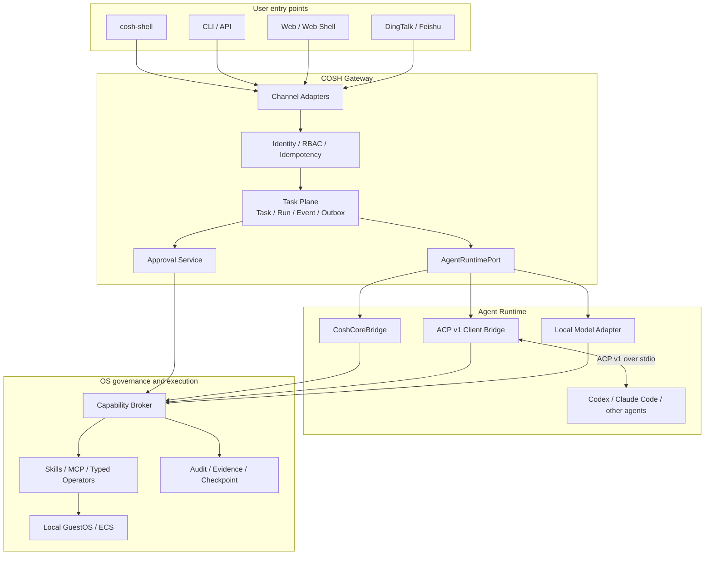

# COSH Gateway and ACP Architecture

[中文版](README_zh.md)

COSH Gateway evolves cosh-ng into a local-first operations gateway for agents.
It connects Shell, CLI, Web, and messaging channels to one durable Task Plane,
runs work through replaceable Agent Runtimes, and governs real operating-system
effects through a shared security boundary.

This document is the long-lived architecture baseline for that evolution.
Delivery may be incremental, but implementations must preserve the identity,
durability, Runtime, and authority boundaries defined here.

This document describes target architecture and durable invariants. It does not
claim that every module is available. Current behavior is defined by source,
component READMEs, and user documentation.

Companion decisions and designs:

- [ACP v1 integration decision](acp-v1-decision.md)
- [Rust 1.88 toolchain decision](rust-1.88-decision.md)
- [Task and Runtime model](task-runtime-model.md)
- [Durable Task Plane](durable-task-plane.md)
- [Capability and execution](capability-execution.md)
- [Runtime security boundary](runtime-security.md)
- [Adapter conformance](adapter-conformance.md)

## Positioning

COSH Gateway is the control plane between user entry points, Agent Runtimes,
and GuestOS execution. `cosh-shell` is a privileged entry point and Task
attachment; it does not own durable tasks, agent sessions, or governance state.

This positioning enables:

1. CLI, Shell, Web, and chat clients to act on the same durable Task.
2. Codex, Claude Code, cosh-core, and future on-device agents to share one
   Runtime boundary.
3. Every requested system operation to pass through COSH identity, approval,
   capability, and audit controls.

## Architecture principles

- **Task is the durable control unit.** A Session or process is a resource of
  one Run, not the source of product state.
- **Ingress does not own execution.** Channel adapters translate messages and
  presentation; they do not start agents or execute commands directly.
- **Runtime is replaceable.** Gateway depends on `AgentRuntimePort`; ACP and
  cosh-core are separate implementations.
- **Effects share one governance boundary.** Shell, Skill, MCP, ACP tools, and
  typed operators must not bypass the Capability Broker.
- **Events precede views.** Terminal cards, Web views, and chat messages derive
  from durable events and projections.
- **Local first.** The default deployment uses a local daemon and stdio agents;
  remote control reuses the same Task and authority semantics.
- **Disconnect is recoverable.** Commands are idempotent, events replayable,
  and executions leased. A client disconnect is not a Task cancellation.

## Target architecture



## Layer responsibilities

| Layer | Owns | Does not own |
| --- | --- | --- |
| Channel Adapter | Message translation, thread correlation, presentation, approval input | Task state, agent lifecycle, OS execution |
| Gateway API | Identity, authorization, idempotency, input bounds, local or remote transport | Provider protocols and command execution |
| Task Plane | Task/Run lifecycle, Event, Outbox, leases, recovery, replay | Provider-private output parsing |
| AgentRuntimePort | Start, prompt, cancel, events, and terminal semantics | Durable Tasks and channel delivery |
| ACP Client Bridge | ACP negotiation, Session, updates, permission requests, error mapping | Task, Channel, or OS authorization protocol |
| Approval Service | Durable approval, expiry, one-time decisions, receipts | Arbitrary OS authorization |
| Capability Broker | Actor, Target, Operation, Scope, and Permit binding | User interface and agent sessions |
| Execution Target | Execute an authorized typed operation and return evidence | Expand authority or rewrite Task decisions |

## Core objects

| Object | Meaning |
| --- | --- |
| `Task` | Durable work unit that users can query, reconnect to, and audit |
| `Run` | One Task attempt with its own Runtime and lease |
| `SessionBinding` | Mapping between a COSH Run and an external agent Session |
| `Event` | Append-only fact used for reduction and client replay |
| `Approval` | Durable user or policy decision for one operation |
| `Permit` | Single-use authority bound to Actor, Target, Operation, and Scope |
| `Execution` | The actual effect and its result, error, and evidence references |
| `Attachment` | A Shell, Web, or chat relationship to a Task |

These identifiers are not interchangeable. In particular, an ACP Session ID
must not be used as a Task ID, and process exit does not prove a durable Task
completed reliably.

## Main flow

```text
Ingress submits intent
  -> Gateway authenticates and checks idempotency
  -> create Task and scheduling event
  -> Worker acquires Run lease
  -> AgentRuntimePort starts Runtime
  -> Runtime facts commit atomically to Event/Projection/Outbox
  -> sensitive operation enters Approval and Capability Broker
  -> Execution Target consumes Permit once
  -> result and evidence update Task
  -> Attachments replay or continue from cursors
```

## Security boundaries

- The daemon uses a private local endpoint by default. Remote listeners require
  a separate authentication model and threat model.
- External agents are untrusted Runtime principals. They must not read Gateway
  storage, connect as an operator, or inherit host root authority.
- ACP capability negotiation describes protocol support; it does not grant an
  OS capability.
- Permission requests without exact Task, Run, Actor, Target, Operation, and
  digest correlation fail closed.
- Timeout, crash, or transport loss with an uncertain effect requires
  reconciliation or operator action; it is never retried blindly.
- Audit records contain bounded structured summaries and evidence references,
  not credentials or unbounded raw output.

## Delivery streams

| Stream | Deliverable | Completion condition |
| --- | --- | --- |
| Foundation contracts | Rust 1.88, Task/Run/Event types, `AgentRuntimePort`, errors, identity | Side-effect-free types, explicit versions, independent tests |
| Local Task Plane | Daemon, worker, Outbox, Run lease, recovery, event replay | Tasks survive disconnect and restart or settle deterministically |
| ACP Runtime | ACP v1 bridge, versioned Codex/Claude adapters, cancellation, conformance | Adapters share one Runtime contract and terminal semantics |
| Approval and execution | Approval, Broker, Permit, Execution, audit correlation | Effects are traceable, denied paths do not execute, Permit is single-use |
| Shell Attachment | Submit, observe, replay, approve, cancel, detach/reattach | Interactive Shell and durable Task coexist without a second state machine |
| Channel Adapter | Web or messaging identity, idempotency, delivery | Channels do not own agents or OS execution and recover after disconnect |
| GuestOS expansion | ECS Target, checkpoint, rollback, on-device agents | Reuse the same capability and audit model |

Shared contracts stabilize before their producers and consumers. Modules
communicate only through versioned commands, events, and ports.

## Contributing

Contributors can work independently on Runtime adapters, Task storage,
approval, Shell attachment, channel adapters, or conformance tests. Each change
must:

- name the architecture boundary it implements;
- keep provider and channel-private types out of core contracts;
- test new commands, events, transitions, and error paths;
- fail closed on authority, cancellation, crash recovery, and effect replay;
- preserve existing Shell and cosh-core paths during incremental migration;
- update an ADR when a boundary changes and user docs when behavior ships.
