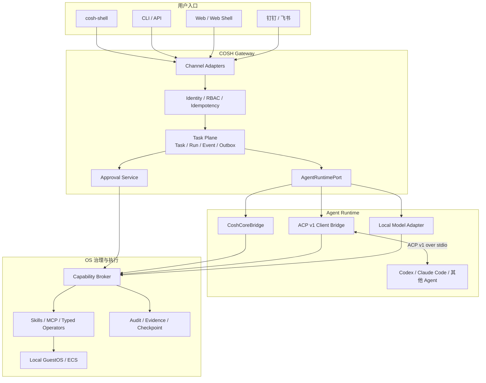

# COSH Gateway 与 ACP 架构

COSH Gateway 将 cosh-ng 扩展为本地优先的 Agent 运维网关。它把 Shell、CLI、Web 和
消息渠道接入同一个持久 Task Plane，通过可替换的 Agent Runtime 处理任务，并由统一的
OS 治理层约束真实环境中的副作用。

本文是 Gateway 演进的长期架构基线。实现可以分阶段推进，但不得破坏这里定义的身份、
持久性、Runtime 和权限边界。

配套决策：

- [ACP v1 接入决策](acp-v1-decision_zh.md)
- [Rust 1.88 工具链决策](rust-1.88-decision_zh.md)

## 定位

COSH Gateway 是连接用户入口、Agent Runtime 和 GuestOS 执行面的控制平面。
`cosh-shell` 是高权限入口和 Task Attachment，不独占会话、任务或治理状态。

该定位解决三个问题：

1. CLI、Shell、Web 和聊天工具可以操作同一项持久任务。
2. Codex、Claude Code、cosh-core 和后续端侧 Agent 可以通过统一 Runtime 边界接入。
3. Agent 提出的系统操作必须经过 COSH 的身份、审批、Capability 和审计边界。

## 架构原则

- **Task 是持久控制单元。** Session 和进程只是一次 Run 的运行资源。
- **入口不拥有执行权。** Channel Adapter 只转换消息和展示，不直接启动 Agent 或执行命令。
- **Runtime 可替换。** Gateway 依赖 `AgentRuntimePort`，ACP 和 cosh-core 是不同实现。
- **副作用统一治理。** Shell、Skill、MCP、ACP Tool 和 Typed Operator 不得绕过 Capability Broker。
- **事件先于界面。** Terminal card、Web 页面和聊天消息都由持久事件与 Projection 生成。
- **本地优先。** 默认部署使用本机 daemon 与 stdio Agent；远程控制复用相同 Task 和权限语义。
- **弱网可恢复。** 请求幂等、事件可重放、执行有租约，断线不等于取消任务。

## 目标架构



## 分层职责

| 层级 | 负责 | 不负责 |
|------|------|--------|
| Channel Adapter | 消息转换、线程关联、状态展示、审批输入 | Task 状态机、Agent 生命周期、OS 执行 |
| Gateway API | 身份、授权、幂等、输入边界、本地或远程传输 | Provider 协议和命令执行 |
| Task Plane | Task/Run 生命周期、Event、Outbox、租约、恢复和重放 | 解析 Provider 私有输出 |
| AgentRuntimePort | 启动、Prompt、Cancel、事件和终态的统一语义 | 持久任务和渠道投递 |
| ACP Client Bridge | ACP 协商、Session、更新、权限请求和错误映射 | 充当 Task、Channel 或 OS 权限协议 |
| Approval Service | 持久审批、超时、一次性决策和回执 | 直接授权任意系统操作 |
| Capability Broker | 绑定 Actor、Target、Operation、Scope 和 Permit | 用户界面和 Agent 会话 |
| Execution Target | 在本机或 ECS 执行已授权操作并返回证据 | 自行扩大权限或修改 Task 决策 |

## 核心对象

| 对象 | 语义 |
|------|------|
| `Task` | 用户可查询、重连和审计的持久工作单元 |
| `Run` | Task 的一次执行尝试，拥有独立 Runtime 和租约 |
| `SessionBinding` | COSH Run 与外部 Agent Session 的映射 |
| `Event` | 只追加的事实记录，用于状态归约和客户端重放 |
| `Approval` | 用户或策略对特定操作的持久决策 |
| `Permit` | 绑定 Actor、Target、Operation 和 Scope 的一次性执行凭证 |
| `Execution` | 实际副作用及其结果、错误和证据引用 |
| `Attachment` | Shell、Web 或聊天线程对 Task 的观察或控制关系 |

这些 ID 不得互相替代。尤其不能把 ACP Session ID 当作 Task ID，也不能把进程退出
当作持久任务已经可靠完成。

## 主流程

```text
入口提交意图
  -> Gateway 鉴权与幂等校验
  -> 创建 Task 和待调度事件
  -> Worker 获取 Run Lease
  -> AgentRuntimePort 启动 Runtime
  -> Runtime 事件原子写入 Event/Projection/Outbox
  -> 高风险操作进入 Approval 和 Capability Broker
  -> Permit 被 Execution Target 单次消费
  -> 结果和证据回写 Task
  -> 所有 Attachment 按 Cursor 重放或继续订阅
```

## 安全边界

- daemon 默认使用本地私有端点；远程监听必须定义独立的认证机制和威胁模型。
- 外部 Agent 是不可信 Runtime，不能直接获得 Gateway 数据库或宿主 root 权限。
- ACP capability 只表示协议能力，不表示 COSH 已授予 OS 权限。
- 未关联 Task、Run、Actor 或操作摘要的权限请求必须 fail closed。
- 发生超时、崩溃或网络断流时，不确定副作用进入人工确认状态，不自动重试。
- 审计记录保存结构化摘要和有界证据引用，不持久化凭证或无限原始输出。

## 实现路线

| 工作流 | 交付内容 | 完成条件 |
|--------|----------|----------|
| 基础 Contract | Rust 1.88、Task/Run/Event 类型、`AgentRuntimePort`、错误和身份模型 | 类型无副作用、版本边界明确、可以独立测试 |
| 本地 Task Plane | daemon、Task Worker、Outbox、Run Lease、恢复和事件重放 | Task 可在进程和客户端断线后继续、恢复或确定性终止 |
| ACP Runtime | ACP v1 Client Bridge、Codex/Claude Code Adapter、Cancel 和 conformance | 两个 Adapter 通过相同 Runtime Contract，错误和终态一致 |
| Approval 与执行 | Approval、Capability Broker、Permit、Execution 和审计关联 | 所有副作用可追溯，拒绝路径不执行，Permit 只能消费一次 |
| Shell Attachment | 提交、查看、回放、审批、取消和 detach/reattach | 手动 Shell 与持久 Task 共存，不引入第二套状态机 |
| Channel Adapter | Web 或消息渠道接入、身份映射、幂等和结果投递 | 渠道不直接持有 Agent 或 OS 执行权，弱网后可以续传 |
| GuestOS 扩展 | 单机到 ECS Target、Checkpoint、Rollback 和端侧 Agent | 复用同一 Capability 与审计模型，不按渠道或 Agent 分叉 |

这些工作流可以由不同贡献者并行推进。共享 Contract 应先于其生产者和消费者稳定，模块
之间只通过已定义的 command、event 和 port 连接。

## 参与开发

社区贡献可以从 Runtime Adapter、Task storage、Approval、Shell Attachment、Channel
Adapter 或 conformance test 中选择独立切入点。每项变更应满足以下约束：

- 说明所实现的架构边界，不把 Provider 或渠道私有类型扩散到核心 Contract。
- 为新增 command、event、状态迁移和错误路径提供可重复测试。
- 对权限、取消、崩溃恢复和副作用重试采用 fail-closed 语义。
- 保持现有 cosh-shell 和 cosh-core 路径可用，迁移通过 Port 逐步完成。
- 架构边界变化时同步更新本文或新增 ADR，功能可用性写入用户文档。
