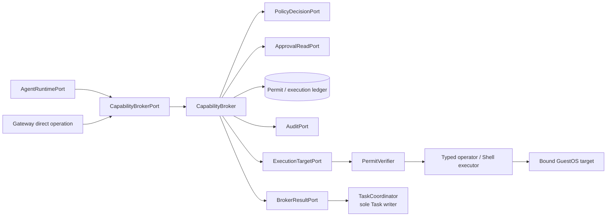

# Phase 1 Capability Broker Design

[中文版](design_zh.md) | [Acceptance report](acceptance.md)

## Status and decision

This design is based on upstream commit
`6c115aefe04ace0d169a24fa7cd55ad7c1befa52`. The first process-local logic slice is implemented,
but it is not a complete Phase 1 security claim. The
`CapabilityBroker` is the mandatory policy enforcement and permit authority for every OS side
effect, regardless of whether intent originates in Gateway, cosh-core, ACP, a local model, Shell,
a Skill, MCP, or a workflow. An execution target accepts work only with a valid, target-bound,
operation-bound permit.

Approval is necessary when policy requests it but is never itself executable authority. A
committed approval may authorize the Broker to issue a narrower permit; it cannot widen actor,
target, action, resource, lifetime, or execution count.

## Implemented process-local slice

The Gateway now contains a provider-neutral
[`PolicyPort`](../../../../../crates/cosh-gateway/src/capability/broker.rs),
[`PermitStore`](../../../../../crates/cosh-gateway/src/capability/broker.rs), and
`CapabilityBroker`. Authorization validates request expiry, exact Task and Run parents, the
complete authenticated `ActorRef`, and an `AuthoritativeRequestBinding` before consulting policy.
The binding pins exact target, full `OperationDescriptor`, complete operation digest, and requested
scope. Actor provenance or request-content substitution therefore cannot influence policy. Policy
can deny, require approval, or allow. Zero policy revision and already-expired policy authority
fail closed.

Direct allowance issues an `ExecutionPermit` bound to actor, Task, Run, Execution, exact
`TargetRef`, complete canonical operation digest, policy revision, expiry, and one use. The
operation digest covers namespace, name, and normalized arguments; `arguments_digest` remains
available only as narrower policy detail. A trusted ingress owns canonicalization and hashing.
The Broker never derives authority from the argument-only digest. The process-local
[`MemoryPermitStore`](../../../../../crates/cosh-gateway/src/capability/memory.rs) validates those
fields and marks a permit consumed under one mutex, so exactly one concurrent caller can claim it.
A failed binding check does not consume authority.

This slice deliberately stops before an effect. `MemoryPermitStore` is non-durable and loses its
state on process exit. Approval produces only an `ApprovalRequest`; no durable approval ledger,
resolution lookup, or approval-based re-authorization exists, and directly allowed permits have
`approval_id = None`. Immutable target resolution, lease/runtime binding, durable permit and
execution state, audit gating, revocation, OS execution, network/ACP APIs, crash recovery, and
reconciliation remain unimplemented.

## Goals

- Normalize all side-effect intent into one typed `CapabilityRequest`.
- Evaluate actor, Task, Run, target, operation, resource scope, risk, and policy revision together.
- Return a stable denial, a durable approval specification, or a short-lived target-bound permit.
- Bind each permitted effect to one `ExecutionId` and a replay-safe execution ledger.
- Make opaque Shell commands fail closed and prefer deterministic typed operators.
- Correlate Task control events with the existing unified security audit contract.
- Preserve a safe local/offline policy path without weakening target or approval checks.

## Non-goals

- Owning the Task aggregate, channel approval UI, Agent lifecycle, PTY rendering, or provider
  session.
- Treating `cosh audit check`, an approval callback, a model tool name, or a policy decision as a
  permit.
- Guaranteeing exactly-once effects across a process or machine crash.
- Granting broad shell, root, filesystem, or network access because a caller is local.
- Supporting remote attestation before the Phase 0 target identity decision is accepted.
- Parsing arbitrary natural language into OS authority.

## Current-source evidence

| Evidence at `6c115aef` | Reusable behavior | Security gap |
| --- | --- | --- |
| [`cosh-types/audit/event.rs`](../../../../../crates/cosh-types/src/audit/event.rs) | Typed `Action`, policy `Decision`, audit identity, versioned event, and redaction shapes. | No capability request, Execution ID, target identity, or permit. |
| [`cosh-platform/audit/evaluate.rs`](../../../../../crates/cosh-platform/src/audit/evaluate.rs) | Deterministic first-match PDP with allow/deny/require-approval. | A policy result is not execution authority. |
| [`cosh-platform/audit/action.rs`](../../../../../crates/cosh-platform/src/audit/action.rs) | Shell action parsing rejects unsupported compound/metacharacter shapes. | Coverage is command-policy classification, not complete target binding. |
| [`cosh-platform/audit.rs`](../../../../../crates/cosh-platform/src/audit.rs) | Policy checks and security-boundary audit segment writes exist. | There is no permit ledger or consume protocol. |
| [`cosh-core/core.rs`](../../../../../crates/cosh-core/src/core.rs) | Hook and policy decisions, approvals, audit events, and tool execution are integrated. | Allowed tools execute inside core; approval does not pass through a common Broker. |
| [`cosh-core/protocol.rs`](../../../../../crates/cosh-core/src/protocol.rs) | `can_use_tool` includes tool, input, tool-use ID, hook flag, and audit reference. | It lacks Task/Run/target/Execution IDs and a permit. |
| [`cosh-platform/pkg.rs`](../../../../../crates/cosh-platform/src/pkg.rs), [`svc.rs`](../../../../../crates/cosh-platform/src/svc.rs), and [`checkpoint.rs`](../../../../../crates/cosh-platform/src/checkpoint.rs) | Typed OS operations and some dry-run paths exist. | Callers invoke them without a shared permit verifier. |

At baseline, `cosh-cli`, `cosh-core`, and Shell execution paths can reach side effects without a
target-bound Broker permit. The existing policy and audit modules are foundations, not evidence
that the Broker already exists.

## Ownership and ports



The Broker owns capability normalization, policy orchestration, permit issuance, permit
consumption state, and execution correlation. Execution adapters own the last-mile operation and
must verify the permit immediately before use. `TaskCoordinator` owns approval state and Task
events; the Broker submits results but never writes Task storage.

Conceptual ports are:

```rust
trait CapabilityBrokerPort {
    async fn authorize(&self, request: CapabilityRequest)
        -> Result<CapabilityDecision, BrokerError>;
    async fn execute(&self, request: PermittedExecution)
        -> Result<ExecutionReceipt, BrokerError>;
    async fn reconcile(&self, execution_id: ExecutionId)
        -> Result<ExecutionStatus, BrokerError>;
}

trait PolicyDecisionPort {
    async fn evaluate(&self, action: PolicyAction, context: PolicyContext)
        -> Result<PolicyDecision, PolicyError>;
}

trait ApprovalReadPort {
    async fn verified_resolution(&self, approval_id: ApprovalId)
        -> Result<ApprovalResolution, ApprovalError>;
}

trait ExecutionTargetPort {
    async fn execute(&self, request: VerifiedExecution)
        -> Result<TypedExecutionResult, TargetError>;
    async fn reconcile(&self, execution_id: ExecutionId)
        -> Result<TargetExecutionStatus, TargetError>;
}
```

The current slice implements synchronous `PolicyPort::evaluate`, `PermitStore::issue`, and
`PermitStore::consume`, plus `CapabilityBroker::authorize` and `CapabilityBroker::claim`. The
conceptual `execute`, `reconcile`, approval-read, audit, and target ports remain future boundaries.
The Broker has no Task storage or executor dependency.

Neutral IDs and wire DTOs are implemented in the side-effect-free
`cosh-gateway-contracts` leaf. Policy adapters can
reuse `cosh-types` audit types without moving Task/Gateway contracts into `cosh-types`.

## Capability request schema

The implemented leaf request contains request, Task, Run and Actor identity, `TargetRef`, a
namespace/name/arguments-digest operation descriptor, a separate complete canonical operation
digest, requested resource/access scope, input digest, and expiry. Trusted ingress code must
canonicalize and hash the complete operation before constructing the request and the independent
`AuthoritativeRequestBinding`. `RequestContext` supplies the current time, parent binding, and
authoritative target/descriptor/digest/scope. The Broker compares every field before policy and
does not rebuild authority from presentation fields.
The extended target schema below remains the architecture target; runtime principal, lease fence,
effect classification, typed operation variants, and prior approval correlation are not yet
represented by the first slice.

```text
CapabilityRequest {
  request_id, task_id, run_id, tool_use_id?,
  actor_context, runtime_principal,
  target_ref, expected_target_kind,
  operation: CapabilityOperation,
  resource_scope, effect_class,
  canonical_input_digest,
  run_lease_fence, issued_at, deadline,
  prior_approval_id?
}
```

`CapabilityOperation` is a closed, versioned enum for supported operations:

```text
FileRead, FileWrite, DirectoryList, ProcessInspect, ProcessSignal,
PackageQuery, PackageInstall, PackageRemove,
ServiceQuery, ServiceStart, ServiceStop, ServiceRestart,
CheckpointList, CheckpointCreate, CheckpointRestore,
NetworkConnect, ShellCommand, PtyAttach, SkillInvoke, McpToolInvoke
```

Each variant carries typed fields and explicit limits. Unknown operations fail with
`unsupported_capability`; they never fall back to `ShellCommand`. `raw` strings may be retained as
bounded audit display data but are excluded from policy matching unless a specific parser has
normalized them.

Effect classes are `Observe`, `WorkspaceWrite`, `HostMutation`, `PrivilegedMutation`,
`ExternalNetwork`, and `InteractiveControl`. Classification is an input floor: a policy may raise
risk but cannot lower a typed operation below its built-in minimum.

## Target identity

`TargetRef` is a user-facing selection and never appears in a permit. Before policy evaluation,
`TargetResolver` pins it to an immutable `TargetIdentity`:

```text
TargetIdentity {
  target_kind,
  installation_id,
  machine_or_instance_identity,
  boot_or_agent_epoch,
  execution_namespace,
  workspace_root_identity?,
  effective_uid,
  platform_fingerprint
}
```

For a local target, identity is derived from daemon installation, pinned workspace/namespace,
machine and boot identity, and effective credentials. For a remote GuestOS target, Phase 0 must
define authenticated instance/agent epoch and replay resistance. A hostname, IP, display label,
workspace path string, channel installation, or caller-provided instance ID is insufficient.

Target changes after authorization invalidate the decision. Symlink, mount namespace, container,
UID, boot, agent epoch, and workspace-root changes are part of target revalidation where relevant.

The current permit binds the exact `TargetRef`, which rejects direct target substitution but does
not provide immutable target identity or attestation. No OS executor is connected while this gap
remains.

## Decision and approval flow

The current slice implements the first three outcomes only: deny, approval request, and permit.
Approval resolution and re-authorization are not implemented, so the later approval steps below
remain design requirements.

The Broker returns one of:

```text
Denied { reason_code, policy_revision }
ApprovalRequired { approval_spec, operation_digest, target_digest, expires_at }
Permitted { permit }
AlreadyExecuting { execution_id, status }
ReconciliationRequired { execution_id, reason_code }
```

Flow:

1. Validate schema, actor/runtime principal, Task/Run binding, lease fence, deadline, and limits.
2. Resolve and pin `TargetIdentity`; canonicalize operation and resource scope.
3. Compute operation and target digests, then evaluate built-in risk floor and loaded policy.
4. Persist and audit denial, or return `ApprovalRequired` to `TaskCoordinator`.
5. The coordinator commits `ApprovalRequested`; presentation delivers it asynchronously.
6. The coordinator commits the first valid resolution and re-submits the same capability request
   with `ApprovalId` and approval revision.
7. The Broker reads and verifies that resolution, re-resolves target and policy, then issues a
   permit that is no broader and no longer-lived than the approved specification.
8. Execution consumes the permit through the ledger and invokes the target adapter.

Policy or target changes between approval and permit issuance force re-evaluation. A more
restrictive result denies or requests new approval; an approval is never carried across a widened
scope.

## Permit contract

The implemented `ExecutionPermit` binds permit/request/execution IDs, actor, Task, Run, exact
target, complete operation digest, policy revision, optional approval ID, expiry, and
`single_use = true`.
It does not yet carry immutable target identity, runtime/lease fence, durable issuance timestamps,
revocation state, or cross-process integrity proof.

```text
CapabilityPermit {
  permit_schema_version,
  permit_id, execution_id,
  task_id, run_id, actor_id, runtime_principal,
  target_identity_digest,
  operation_kind, operation_digest, resource_scope_digest,
  policy_revision, approval_id?, approval_revision?,
  run_lease_fence,
  issued_at, not_before, expires_at,
  use_limit = 1,
  broker_nonce, integrity_proof
}
```

Phase 1 local execution SHOULD use an opaque ledger-backed permit handle plus integrity proof,
rather than a self-contained broad bearer token. `PermitVerifier` validates every field, current
target identity, expiry, fence, and ledger state. Permit serialization is bounded and excludes
raw command, secret, output, or credential values.

Invariants:

- one permit maps to one `ExecutionId`, one exact operation digest, and one target digest;
- a permit cannot be transferred across actor, Task, Run, Runtime, target, workspace, or boot;
- a used, expired, revoked, stale-fence, malformed, or unknown permit fails closed;
- permit renewal is not supported; a fresh request and current policy produce a new permit;
- approval may narrow the requested operation but cannot issue a wildcard permit;
- target adapters never accept an unpermitted typed operation or raw shell fallback.

## Transaction, idempotency, and execution ledger

Authorization deduplicates by `(TaskId, RunId, RequestId, operation_digest, target_digest)`. A retry
returns the original denial, approval specification, or still-valid unconsumed permit. Reusing a
`RequestId` for another digest returns `idempotency_conflict`.

The current memory store atomically records permit metadata for one process. It has no durable
`Ready` record or audit boundary. Production issuance must atomically record permit metadata,
`ExecutionId`, policy/approval references, expiry, and `Ready` status in a durable ledger.
Security-boundary audit persistence remains required before production authority becomes usable.

The current `claim` validates actor, Task, Run, Execution, target, operation digest, policy
revision, expiry, and single-use state under the same mutex, then consumes the permit. The target
execution design atomically transitions `Ready -> Claimed` using permit ID, fence, and a target
executor
claim. Before the effect, it records `Started` audit evidence. The target returns a typed result
and reconciliation evidence; the ledger transitions to `Succeeded`, `Failed`, or `Uncertain`.
Repeated execute calls return the stored terminal result or `execution_in_progress`; they never
create another effect.

A crash after `Claimed` or `Started` can leave the effect unknown. Recovery asks
`ExecutionTargetPort.reconcile(ExecutionId)`. It does not reset the permit to `Ready`. If the
target cannot prove a terminal result, status becomes `Uncertain`, the Task suspends, and an
operator-safe reconciliation decision is required.

## Shell and typed operator rules

Typed `cosh-platform` operations are preferred because their action and resource fields can be
bound exactly. Existing `cosh-cli` remains a user-facing envelope; the Broker SHOULD call typed
platform adapters or a narrowly defined operator protocol, not parse arbitrary CLI output to infer
authority.

`ShellCommand` is an exceptional operation:

- tokenize before classification, including tab/newline separators;
- reject shell metacharacters and compound/unspaced variants unless an isolated, explicit
  high-risk executor contract supports them;
- bind exact argv, executable identity, cwd/workspace identity, selected environment names,
  UID, timeout, output budget, and target;
- never allow a permit for a prefix, free-form continuation, or inherited interactive shell;
- require a separate `PtyAttach` permit for interactive ownership;
- fail closed when parsing, executable resolution, target pinning, or policy classification is
  incomplete.

In the brokered cosh-core profile, direct side-effecting core tools are disabled or delegated.
Current host-executed shell response support is usable only after the Bridge obtains a permit and
the execution target returns evidence. It is not a blanket approval response.

## Security audit and Task correlation

Task events and security audit events remain separate. The Broker emits audit events for request,
policy result, approval correlation, permit issuance/denial/revocation, execution start, terminal
result, and uncertainty. Events carry bounded `TaskId`, `RunId`, `RequestId`, `ToolUseId`,
`ExecutionId`, policy revision, target digest, result code, duration, and redaction status.

Sensitive values are represented by digests or opaque evidence references. The existing audit
store's security-boundary durability behavior is required for permit issuance and execution
start. Best-effort audit mode cannot authorize privileged mutation in the Broker path.

## Error model

Stable categories include `invalid_capability`, `unsupported_capability`, `forbidden`,
`approval_required`, `approval_invalid`, `approval_expired`, `target_unresolved`,
`target_changed`, `policy_changed`, `idempotency_conflict`, `permit_expired`, `permit_revoked`,
`permit_consumed`, `permit_scope_mismatch`, `stale_lease`, `audit_unavailable`,
`execution_in_progress`, `execution_uncertain`, `target_unavailable`, and `internal`.

Errors distinguish safe same-request retry, new authorization, new approval, target
reconciliation, and non-retryable denial. They never echo secret inputs or unbounded target
output. Transport timeout is not evidence that an effect did not occur.

## Migration and compatibility

1. Freeze Phase 0 capability, target identity, permit, audit correlation, and approval schemas.
2. Introduce the policy boundary and in-memory permit ledger. **Pure logic implemented; fake
   target and production policy adapter remain.**
3. Add persistent permit/execution ledger and required audit boundary.
4. Route new Gateway typed operations through Broker while old direct CLI remains opt-in legacy.
5. Add brokered `CoshCoreBridge` profile with direct side-effecting core tools disabled/delegated.
6. Route Shell/ACP/Skills/MCP paths only as their adapters gain complete coverage.
7. Remove or explicitly isolate legacy bypasses only after parity and recovery acceptance passes.

Rollback disables brokered mode and preserves existing binaries, but it also removes the new
security guarantee. A release must never advertise “all side effects governed” while any enabled
production adapter retains a direct bypass.

## Dependencies

- Phase 0 identity, target, capability, schema compatibility, storage, secret, and threat-model
  decisions.
- [Task Execution Plane](../task-execution-plane/design.md): Task/Run state, durable approval, and
  result recording.
- [Gateway API](../gateway-api/design.md): actor and direct-operation ingress.
- [Cosh Core Bridge](../cosh-core-bridge/design.md): JSONL tool-intent translation and brokered
  runtime profile.
- `cosh-platform` typed operations and audit policy/storage remain implementation foundations.

## Implementation work breakdown

1. Define capability, target, approval reference, permit, and execution result schemas.
2. Implement target resolution/pinning and canonical operation/resource digests.
3. Adapt current audit policy evaluation with built-in minimum effect classification.
   **Only the neutral policy port exists.**
4. Implement decision flow and durable approval correlation without Task writes.
   **Branching exists; durable resolution and re-authorization remain.**
5. Implement permit issuance, verification, revocation, consume, and execution ledger.
   **Process-local issue/claim exists; durability, revocation, and execution lifecycle remain.**
6. Implement typed local target adapters and strict Shell command/Pty paths.
7. Add required security audit events and Task correlation references.
8. Integrate Gateway and `CoshCoreBridge`, then Phase 2 ACP and presentation paths.
9. Add bypass inventory and build-time dependency/coverage checks.

## Test strategy

Eight current unit tests cover request expiry and parent substitution, deny and approval branches,
policy failure and invalid authority, complete permit binding, binding mismatch without
consumption, expiry/replay, and eight-way concurrent claim. The broader security suite remains:

- Schema golden/property tests for stable digests and ID type separation.
- Table tests for built-in risk floor plus every policy decision and approval transition.
- Adversarial Shell corpus covering tabs, newlines, unspaced metacharacters, path substitution,
  symlink/mount changes, environment injection, and executable replacement.
- Target substitution tests across workspace, UID, boot/agent epoch, container, and remote instance.
- Permit tests for expiry, replay, tampering, stale fence, cross-actor/Task/target use, and revoke.
- Concurrent consume tests proving one permit produces at most one claimed Execution ID.
- Kill-point tests before/after claim, audit start, OS invocation, result capture, and Task callback.
- Reconciliation tests for typed success, typed failure, in-progress, and unknown effects.
- Bypass tests proving enabled Gateway/Core/Shell/ACP/Skill/MCP mutation paths cannot reach an
  executor without `PermitVerifier`.

## Open questions

| Question | Owner | Phase 1 default |
| --- | --- | --- |
| What is the canonical local/remote target identity? | Phase 0 identity/security | Local pinned identity only; remote blocked. |
| Is the permit opaque or signed across processes? | Broker/security | Opaque ledger-backed local handle; integrity proof at process boundary. |
| Which audit mode gates mutation? | Security/audit | Required for permit issuance and execution start. |
| Can opaque compound shell ever be permitted? | Security/executor | Deny in initial profile; prefer typed operator. |
| How is a post-crash effect reconciled? | Target owner | Per-operation typed probe; unknown suspends Task. |
| When is legacy direct CLI removed? | Product/release | After parity, recovery, and bypass inventory acceptance. |
